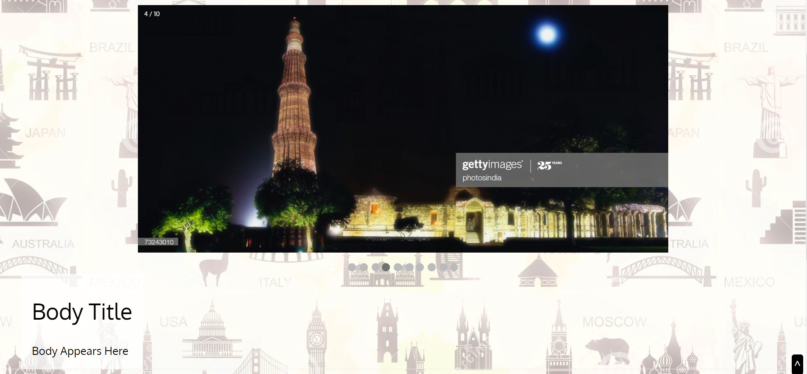
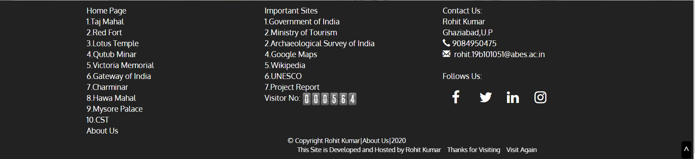

# Monuments of India
## Website Structure
Header Section : It includes name of title and 3 Buttons.

************************************************************
Body Section : It includes Image slideshow with body content.

***********************************************************
Footer Section : It includes links to other webpages,websites and many more.

************************************************************
## Website Sitemap
This websites consists of 12 Self made webpages and other external links.\
1.[Monuments of India](https://rk-rohitkumar.github.io/monuments/monuments.html)|[View Code](monuments.html)\
2.[Taj Mahal](https://rk-rohitkumar.github.io/monuments/tajmahal.html)|[View Code](tajmahal.html)\
3.[Red Fort](https://rk-rohitkumar.github.io/monuments/redfort.html)|[View Code](redfort.html)\
4.[Lotus Temple](https://rk-rohitkumar.github.io/monuments/lotustemple.html)|[View Code](lotustemple.html)\
5.[Qutub Minar](https://rk-rohitkumar.github.io/monuments/qutubminar.html)|[View Code](qutubminar.html)\
6.[Victoria Memorial](https://rk-rohitkumar.github.io/monuments/victoriamemorial.html)|[View Code](victoriamemorial.html)\
7.[Gateway of India](https://rk-rohitkumar.github.io/monuments/gatewayofindia.html)|[View Code](gatewayofindia.html)\
8.[Charminar](https://rk-rohitkumar.github.io/monuments/charminar.html)|[View Code](charminar.html)\
9.[Hawa Mahal](https://rk-rohitkumar.github.io/monuments/hawamahal.html)|[View Code](hawamahal.html)\
10.[Mysore Palace](https://rk-rohitkumar.github.io/monuments/mysorepalace.html)|[View Code](mysorepalace.html)\
11.[CST](https://rk-rohitkumar.github.io/monuments/cst.html)|[View Code](cst.html)\
12.[About Us](https://rk-rohitkumar.github.io/monuments/about.html)|[View Code](about.html)
************************************************************
#### Created and Hosted by [Rohit Kumar](https://rebrand.ly/rk/website)
************************************************************
